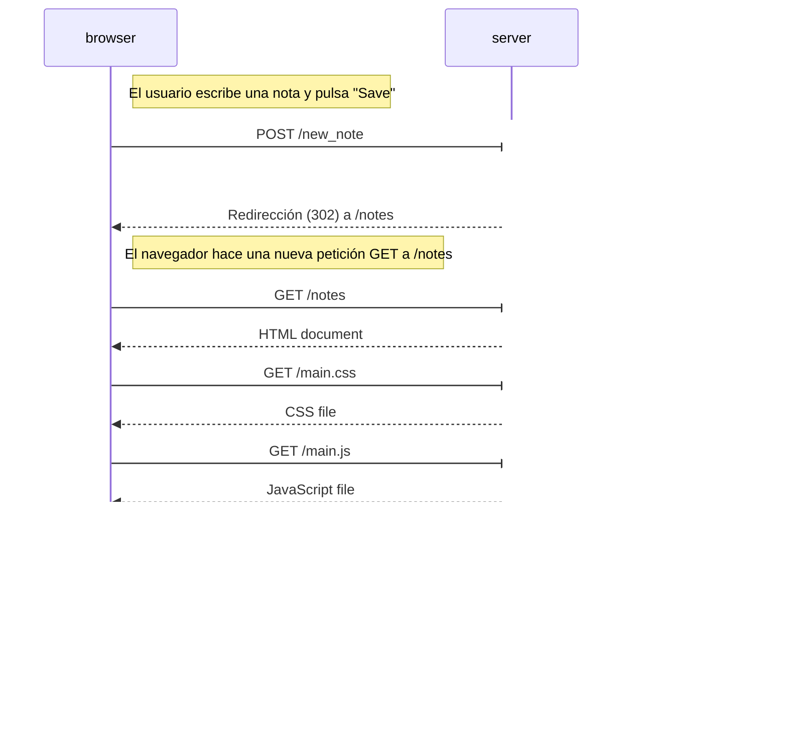

```mermaid

sequenceDiagram

    participant browser
    participant server

    Note right of browser: El usuario escribe una nota y pulsa "Save"

    browser->>server: POST /new_note
    activate server
    Note right of server: El servidor guarda la nueva nota
    server-->>browser: Redirección (302) a /notes
    deactivate server


    Note right of browser: El navegador hace una nueva petición GET a /notes

    browser->>server: GET /notes
    activate server
    server-->>browser: HTML document
    deactivate server

    browser->>server: GET /main.css
    activate server
    server-->>browser: CSS file
    deactivate server

    browser->>server: GET /main.js
    activate server
    server-->>browser: JavaScript file
    deactivate server

    Note right of browser: El navegador ejecuta el JS y hace una petición por los datos

    browser->>server: GET /data.json
    activate server
    server-->>browser: JSON con las notas
    deactivate server

    Note right of browser: Se renderizan todas las notas 
```

